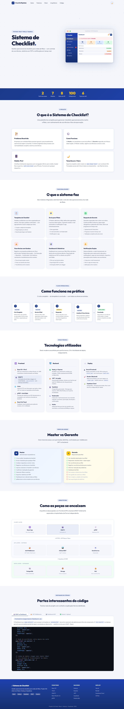

<div align="center">

# ✓ Sistema de Checklist — Showcase

**Sistema interno de verificação de conformidade entre lojas**  
Diretoria cria templates, envia checklists para as filiais, gerentes respondem com foto e observação por item — ocorrências viram fluxo rastreável até a resolução.

<br/>


</div>

---

## 💼 Visão de Negócio

> **Problema** — Verificação de conformidade entre filiais dependia de comunicação manual por mensageria e e-mail, sem padronização dos itens checados, sem foto como evidência e sem rastreabilidade até a resolução das ocorrências.
>
> **Solução** — Sistema interno que centraliza o ciclo: master cria template → envia à filial → gerente responde com foto e observação por item → master analisa, registra ocorrência → fluxo de resolução com notificações por e-mail.
>
> **Resultado** — Diretoria passa a ter visibilidade em tempo real da conformidade operacional, com histórico auditável, dashboard agregado e exportação em PDF.

| | |
|---|---|
| **Contexto** | Comercial Maranguape — operação multi-loja |
| **Usuários** | Diretoria + gerentes de loja |
| **Substitui** | Comunicação manual via mensageria/e-mail |
| **Status** | Apresentado à diretoria · em uso pela operação |

---

## 📸 Preview



## 🎯 Sobre Este Repositório

Este repositório contém **apenas o site de apresentação** (showcase) do Sistema de Checklist. O código-fonte original do sistema (backend + frontend) não está incluído — este projeto serve como vitrine pública explicando a arquitetura, decisões técnicas e funcionamento do sistema.

### O que o showcase apresenta

| Seção | Conteúdo |
|---|---|
| **Hero** | Apresentação animada com mockup interativo do dashboard |
| **Sobre** | Problema resolvido, fluxo operacional, responsividade, dark mode |
| **Funcionalidades** | 6 módulos: Templates, Envios, Respostas, Ocorrências, Dashboard/PDF, Notificações |
| **Fluxo Operacional** | Ciclo completo em 5 etapas com identificação de atores |
| **Stack Técnica** | Frontend, Backend e Deploy com descrições técnicas |
| **Perfis de Acesso** | Comparativo Master vs Gerente com lista de permissões |
| **Arquitetura** | Diagrama em camadas: Client → API Express → Supabase |
| **Destaques de Código** | 4 snippets reais comentados: GSAP, JWT, Dashboard API, Upload paralelo |

---

## 🚀 Como Rodar

**Sem nenhuma dependência ou instalação.** Basta abrir o arquivo:

```bash
# Opção 1 — abrir direto no navegador
index.html  →  duplo clique ou arrastar para o browser

# Opção 2 — servidor local simples (recomendado para evitar CORS)
npx serve .
# ou
python -m http.server 8080
# ou
npx live-server
```

> Requer conexão com internet para carregar as CDNs (GSAP, highlight.js, Google Fonts).

---

## 🗂️ Estrutura do Projeto

```
Sistema de Checklist/
├── index.html       # Estrutura HTML completa — todas as seções
├── style.css        # Estilos, tema escuro/claro, responsividade
├── main.js          # Todas as animações GSAP + interatividade
└── README.md        # Este arquivo
```

**Zero dependências de build.** Nenhum `package.json`, `node_modules` ou passo de compilação.

---

## ⚙️ Tecnologias do Showcase

| Tecnologia | Versão | Uso |
|---|---|---|
| **GSAP 3** | 3.12.5 | Animações de entrada, stagger, ScrollTrigger, timeline do hero |
| **ScrollTrigger** | plugin GSAP | Revelação de seções ao rolar |
| **highlight.js** | 11.9.0 | Syntax highlighting nos snippets de código |
| **Google Fonts** | — | Outfit (texto) + JetBrains Mono (código) |
| **HTML5 / CSS3** | — | Variáveis CSS, grid, flexbox, dark mode via `data-theme` |
| **Vanilla JS** | ES2020+ | Tabs, scroll, tema, eventos |

### Como o GSAP é utilizado

```javascript
// 1. Timeline sequencial no hero (entrada ao carregar a página)
const tl = gsap.timeline({ defaults: { ease: 'power3.out' } });
tl
  .fromTo('#heroBadge',   { opacity: 0, y: -14 }, { opacity: 1, y: 0, duration: 0.45 })
  .fromTo('.hero-title',  { opacity: 0, y: 28  }, { opacity: 1, y: 0, duration: 0.55 }, '-=0.20')
  .fromTo('#heroMockup',  { opacity: 0, x: 36  }, { opacity: 1, x: 0, duration: 0.70 }, '-=0.40');

// 2. ScrollTrigger — revela seções ao entrar na viewport
ScrollTrigger.create({
  trigger: el, start: 'top 88%', once: true,
  onEnter: () => gsap.fromTo(el,
    { opacity: 0, y: 34, scale: 0.96 },
    { opacity: 1, y: 0,  scale: 1, duration: 0.65, ease: 'power3.out' }
  ),
});

// 3. Stagger em cards — cada item entra com delay acumulado
gsap.fromTo('.arch-box',
  { opacity: 0, scale: 0.85 },
  { opacity: 1, scale: 1, stagger: 0.08, duration: 0.42, ease: 'back.out(1.4)' }
);
```

> **Nota técnica:** todos os tweens usam `fromTo()` (não `from()`) porque os elementos começam com `opacity: 0` no CSS. O `gsap.from()` leria o valor atual do CSS como destino — resultando em animação de 0 → 0 (invisível). O `fromTo()` especifica explicitamente os dois estados.

---

## 🏗️ O Sistema Original

O showcase explica um sistema full-stack real com a seguinte stack:

### Frontend
- **React 18** + **Vite 5** — SPA com React Router v6
- **GSAP 3** — animações de entrada e stagger no dashboard
- **Axios** — cliente HTTP com interceptor JWT
- **jsPDF + AutoTable** — exportação de relatórios PDF no cliente
- **React Hot Toast** — feedback de ações

### Backend
- **Node.js** + **Express** — API REST modular (8 rotas)
- **JWT** + **bcryptjs** — autenticação stateless, hash de senhas
- **Supabase JS SDK** — PostgreSQL + Storage
- **Nodemailer** — 6 tipos de e-mail transacional
- **Multer** — upload de arquivos (fotos por item, limite 20MB)

### Banco de Dados
- **Supabase (PostgreSQL)** — tabelas relacionais com RLS
- **Supabase Storage** — armazenamento de fotos e arquivos

### Deploy
- **Vercel** — frontend (SPA routing via `vercel.json`)
- **Render** — backend Node.js (via `render.yaml`, health em `/health`)

---

## 🔄 Fluxo Operacional do Sistema

```
  [Master]              [Gerente]              [Master]
     │                     │                     │
     ▼                     │                     │
Cria Template              │                     │
     │                     │                     │
     ▼                     │                     │
Envia à Filial ──────────► │                     │
     │              Recebe e-mail                │
     │                     │                     │
     │                     ▼                     │
     │             Responde checklist            │
     │             (foto + obs por item)         │
     │                     │                     │
     │                     ▼                     │
     │ ◄─────── Notificação de resposta ─────── ►│
     │                     │                     │
     ▼                     │                     │
Analisa respostas          │                     │
Registra ocorrências       │                     │
     │                     │                     │
     │ ──── Notifica gerente (e-mail) ──────────►│
     │                     ▼                     │
     │             Informa resolução             │
     │                     │                     │
     │ ◄─────── Notificação de resolução ───────┘
     │
     ▼
Confirma resolução
     │
     ▼
Conclui checklist ✓
```

### Status de Ocorrências

```
pendente_aprovacao  →  em_execucao  →  resolvido_gerente  →  confirmado
       │                   │                                     │
       │                   └──── (prazo expirado) ──► atrasado   │
       │                                                          │
       └──────── (rejeitado) ──── devolvido ──────────────────────
```

---

## 👥 Perfis de Acesso

| Funcionalidade | Master | Gerente |
|---|:---:|:---:|
| Criar/editar templates | ✅ | ❌ |
| Enviar checklists para filiais | ✅ | ❌ |
| Responder checklists | ✅ | ✅ |
| Ver dados de outras filiais | ✅ | ❌ |
| Registrar ocorrências | ✅ | ✅ |
| Aprovar/transferir ocorrências | ✅ | ❌ |
| Confirmar resoluções | ✅ | ❌ |
| Gerenciar filiais e usuários | ✅ | ❌ |
| Exportar relatório PDF | ✅ | ❌ |
| @Mencionar outros masters | ✅ | ❌ |
| Dashboard global | ✅ | ❌ |
| Dashboard da filial | ✅ | ✅ |

---

## 🔒 Middleware de Autenticação

```javascript
// Verifica JWT e injeta o payload em req.user
function autenticar(req, res, next) {
  const token = req.headers.authorization?.replace('Bearer ', '');
  if (!token) return res.status(401).json({ error: 'Não autorizado' });
  try {
    req.user = jwt.verify(token, process.env.JWT_SECRET);
    next();
  } catch {
    res.status(401).json({ error: 'Token inválido' });
  }
}

// Guard adicional para rotas exclusivas de master
function somenteMaster(req, res, next) {
  if (req.user?.role !== 'master')
    return res.status(403).json({ error: 'Acesso restrito a masters' });
  next();
}

// Composição nas rotas:
router.get('/',    autenticar,               listarHandler);   // qualquer role
router.post('/',   autenticar, somenteMaster, criarHandler);   // só master
```

---

## 📐 Arquitetura do Sistema

```
┌─────────────────────────────────────────────┐
│              CLIENT LAYER                   │
│                                             │
│   React 18 + Vite    GSAP 3    jsPDF        │
│   React Router v6    Axios     Hot Toast    │
└──────────────────┬──────────────────────────┘
                   │ HTTPS + JWT Bearer Token
┌──────────────────▼──────────────────────────┐
│               API LAYER (Express)           │
│                                             │
│   Auth Middleware    8 Rotas REST           │
│   JWT Verify         /api/auth              │
│   Role Guard         /api/envios            │
│                      /api/problemas         │
│   Email Service      /api/templates  ...    │
│   (Nodemailer)                              │
└──────────────────┬──────────────────────────┘
                   │ Supabase JS SDK
┌──────────────────▼──────────────────────────┐
│             DATA LAYER (Supabase)           │
│                                             │
│   PostgreSQL (dados relacionais)            │
│   Storage    (fotos e arquivos)             │
│   RLS        (Row Level Security)           │
└─────────────────────────────────────────────┘

Deploy:
  Frontend ──► Vercel  (auto-deploy via Git)
  Backend  ──► Render  (via render.yaml)
  Database ──► Supabase Cloud
```

---

## 🎨 Design System

O showcase herda o design system do projeto original:

| Token | Valor | Uso |
|---|---|---|
| `--azul` | `#1B3A8A` | Cor primária, sidebar, botões |
| `--amarelo` | `#F5C518` | Destaque, item ativo da sidebar |
| `--bg` | `#f4f6fb` | Fundo da página |
| `--text` | `#1a2340` | Texto principal |
| `--success` | `#16a34a` | Status conforme, concluído |
| `--danger` | `#dc2626` | Status não conforme, alerta |

**Dark mode** via `data-theme="dark"` no `<html>` com todas as variáveis redefinidas. Persistido em `localStorage`.

---

## 📄 Licença

Este projeto de showcase é de código aberto. O sistema original é proprietário.

---

<div align="center">
  <sub>Showcase estático · GSAP 3 + HTML/CSS/JS puro · Sem build necessário</sub>
</div>
